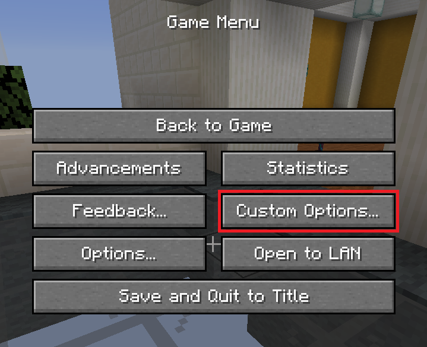
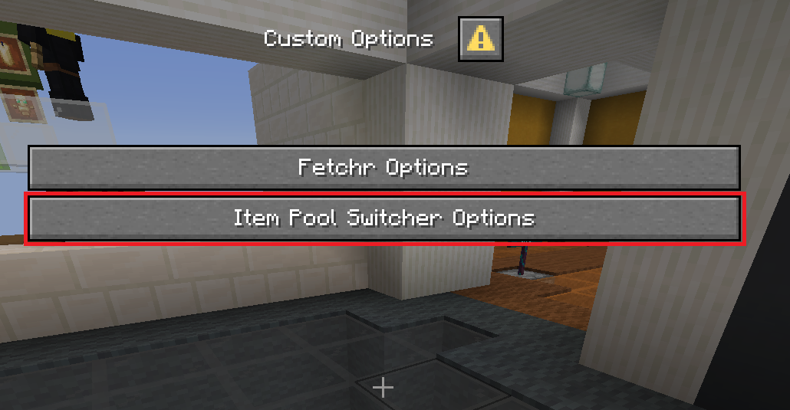
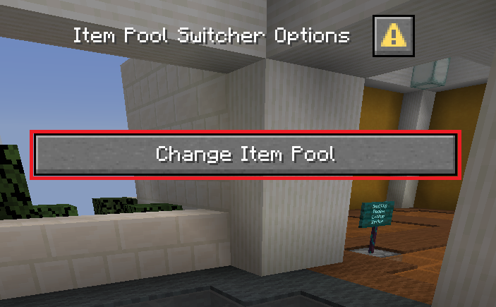
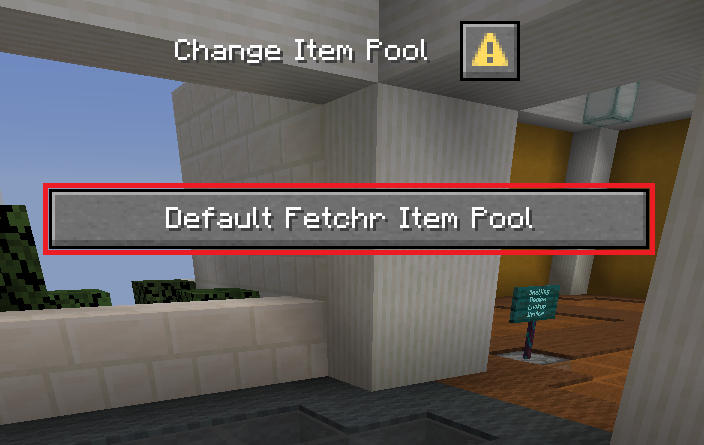

# Item Pool Switcher for Fetchr

This is an utility extension for [Fetchr by NeunEinser](https://github.com/NeunEinser/bingo) to allow switching between different item pools added by other extensions.

For this extension to work properly, all other extensions adding their own item pools have to add their item pools to the item pool list of this extension.

## Download and Installation

Coming soon™

## How to use it

You can open the Item Pool Switcher Options by either pressing your `Quick Actions` key bind (defaults to `G`) or pressing escape, then `Custom Options...` and then `Item Pool Switcher Options`.

Then you click on `Change Item Pool`, then on the item pool you want to switch to and you're done.

## Guides

- [Adding your own item pool to the list](docs/adding_your_own_pool.md)
